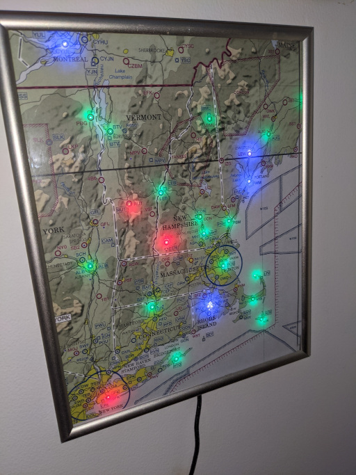

# Metar Map
Neopixels embedded into a map showing live aviation METAR information from aviationweather.com's API



## Parts List
* Neopixel Strip: ~$10
  * ebay search for `WS2812` - lots of options
  * I used some from a previous project. 5m strip. 300 LEDs. Trimmed to ~50 leds.
* ESP8266: ~$14
  * amazon search for `nodemcu` - usually come in packs of 3
* Map:  $2
  * Expired sectionals work great
  * I used Staples print services to print a downloaded map from [vfrmap.com](vfrmap.com)
* Misc. electronics : $1
  * Wires to connect the ESP to the neopixel. 
  * Dupont connector
  * 300 to 500 ohm resistor

## ESP8266 micropython setup collateral

[Flashing instructions](https://docs.micropython.org/en/latest/esp8266/tutorial/intro.html)

picocom install
```
sudo apt-get install picocom
```

ampy install
```
sudo apt-get install python3-pip
pip3 install adafruit-ampy
```
Terminal connection linux
```
picocom /dev/ttyUSB0 -b 115200
```

WiFi connection setup [directions](https://docs.micropython.org/en/latest/esp8266/tutorial/network_basics.html)
```
import network
sta_if = network.WLAN(network.STA_IF)
sta_if.active(True)
sta_if.connect('<your SSID>', '<your key>')
```

Transfer main.py to board
```
ampy -p /dev/ttyUSB0 put main.py
```

Reset from picocom
```
import machine
machine.reset()
```

## URL to test API stuff
https://www.aviationweather.gov/adds/dataserver_current/httpparam?dataSource=metars&requestType=retrieve&format=xml&hoursBeforeNow=5&mostRecentForEachStation=true&stationString=KBTV

Map: https://www.aviationweather.gov/metar

## Credits / Examples / Similar

[@prueker](https://github.com/prueker/METARMap)
* Might be the original - contains blog post with lots of discussion
* Raspberry pi based
* Large scale - uses actual sectional

[@flynnguy](https://github.com/flynnguy/metar-map)
* ESP8266 based
